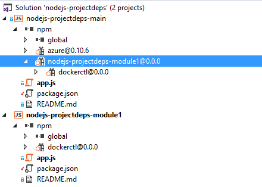

#Dependencias entre proyectos de NodeJs en VS2015

Este proyecto contiene una prueba de como gestionar las dependencias entre proyectos de **NodeJs** usando `npm-link` y **Visual Studio 2015**

Para realizar la prueba he creando una solución de **Visual Studio 2015** con dos proyectos de NodeJs:

```
nodejs-projectdeps
|- nodejs-projectdeps-main -->  proyecto principal
|- nodejs-projectdeps-module1 --> poyecto de librería al que hace referencia el proyecto principal 
```

Los archivos **package.json** de cada uno de los proyectos son:

Proyecto  **nodejs-projectdeps-main**:

```json
{
  "name": "nodejs-projectdeps-main",
  "version": "0.0.0",
  "description": "nodejs-projectdeps-main",
  "main": "app.js",
  "dependencies": {
    "azure": "^0.10.6",
    "nodejs-projectdeps-module1": "0.0.0"
  }
} 
```

Proyecto **nodejs-projectdeps-module1**:

```json
{
  "name": "nodejs-projectdeps-module1",
  "version": "0.0.0",
  "description": "nodejs-projectdeps-module1",
  "main": "app.js",
  "dependencies": {
    "dockerctl": "0.0.0"
  }
}
```

Lo primero que hay que hacer es  ejecutar `npm link` en la carpeta del proyecto `nodejs-projectdeps-module1` para establecer un vínculo entre paquete global y el código fuente:

```
C:\Users\...\npm\node_modules\nodejs-projectdeps-module1 
  -> C:\src\nodejs-projectdeps\nodejs-projectdeps-module1
```

Luego hay que ejecutar `npm link nodejs-projectdeps-module1` en la carpeta del proyecto `nodejs-projectdeps-main` para hacer referencia al proyecto vinculado desde el proyecto principal:

```
C:\src\nodejs-projectdeps-main\node_modules\nodejs-projectdeps-module1 
  -> C:\Users\...\npm\node_modules\nodejs-projectdeps-module1 
    -> C:\src\nodejs-projectdeps\nodejs-projectdeps-module1
```

Así es como queda la solución en **Visual Studio 2015** mostrando las dependencias entre paquetes:
 
